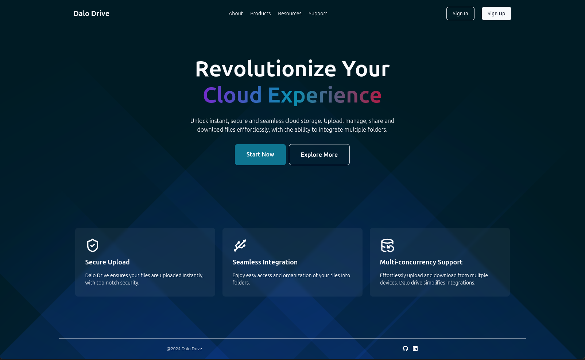

# Dalo Drive

File uploader that uploads our files to the server

---

## Tech Stack

-   **Front End:** Next.js | React | TypeScript | TailwindCSS
-   **Back End:** Next.js | PostgreSQL | Prisma
-   **Other Libraries:** Shadcn UI | Zod

---

## Goal

My goal was to learn next.js features and next-auth

## Key Features

-   Image preview.

-   Flexible drag and drop box.

-   Authentication with traditional email-password and prviders like google and github.

-   Interactive UI.

## What I learned

It was my first time building fullstack apps with **Next.js**.

I practiced almost all aspects of next.js features like server components, server actions, middleware, the latest app router, built-in client side routing, Image and Font optimizations and the beast next-auth.

I have also used my usual **Typescript** with **zod** for better code quality. I have also used **Resend** for email sending.

## Project Images

**Landing Page**

This is the landing page for my web application. I added some cool scroll animaions.



---

## Getting Started

Installation:

```bash
git clone git@github.com:iamsuudi/file-uploader.git
```

Install Dependencies:

```bash
pnpm install
```

Set Up Environment Variables:

Create .env file at the root folder.
1. Create github and google auth app and get their keys for authentication.
2. Create Resend account and get your api key

```js
DATABASE_URL=******

AUTH_SECRET=******

GITHUB_CLIENT_ID=******
GITHUB_CLIENT_SECRET=******

GOOGLE_CLIENT_ID=******
GOOGLE_CLIENT_SECRET=******

RESEND_API_KEY=******

NEXTJS_PUBLIC_URL=******
```

Running Dev Server:

```bash
pnpm dev
```

Running Prod Server:

```bash
pnpm build
pnpm start
```
